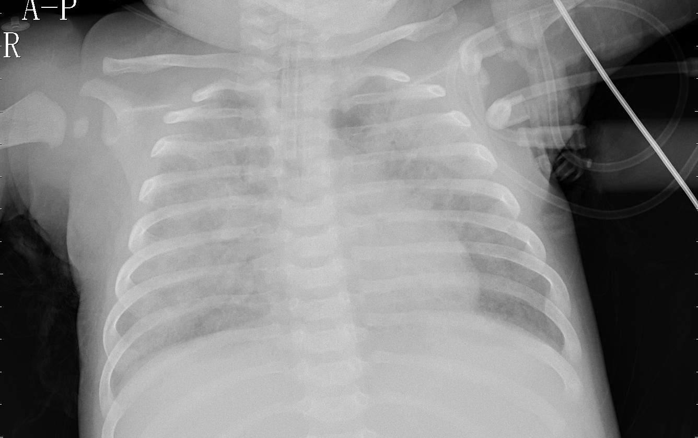

# Image Classification with Deep Learning - Pneumonia
Module 4 Project<br>

# Objective and Goal: 

<b>Objective</b>: Given a chest x-ray image of pediatric patients, build a model that can classify whether a given patient has pneumonia.<br><br>
<b>Goal</b>: Build a deep neural network trained on a large dataset for classification on a non-trivial task.<br><br>
Use x-ray images of pediatric patients to identify whether or not they have pneumonia. The datasets come from <a href="https://www.kaggle.com/paultimothymooney/chest-xray-pneumonia">Kaggle</a>. With Deep Learning, data is king -- the more of it, the better. However, the goal of this project isn't to build the best model possible -- it's to demonstrate my understanding by building a model that works. <br>

To aid in processing time, I used Google Colab to create my models. 


# Outline
* The Data
* The Model
    * Model 1-2 Neural Networks
    * Model 3 First CNN
    * Model 4 CNN with varied values
    * Model 5 CNN with Dropouts added
    * Model 6 CNN with L1 Regularizer
    * Model 7 CNN with L2 Regularizer
* Conclusion
    * Other Considerations


# The Data
The number of images for the train set were extremely unbalanced: 
* Normal images - 84
* Pneumonia images - 1134<br><br>
The number of images for the test set were more balanced: 
* Normal images - 234
* Pneumonia images - 390<br><br>
The pneumonia images were split evenly between viral pneumonia and bacterial pneumonia.

<br><br>


<table>
    <tr>
        <td></td>
        <td></td>
        <td></td>
    </tr>
    <tr>
        <td align="left"><figcaption>Image of a Normal Chest X-ray</figcaption></td>
        <td align="left"><figcaption>Image of a Viral Pneumonia Chest X-ray</figcaption></td>
        <td align="left"><figcaption>Image of a Bacterial Pneumonia Chest X-ray</figcaption></td>
    </tr>
</table>


Pneumonia in children can be difficult to diagnose with x-ray images as illustrated by examining the x-rays above. Physicians may have difficulty determining differences particularly when many images must be evaluated. Convolutional neural networks have proven to aid in a diagnoses.


# The Models
Initially normal neural networks were used but determined to be insufficient. Neural networks are trained using the backpropagation of an error algorithm that involves calculating errors made by the model on the training dataset and updating the model weights in proportion to those errors. The limitation of this method of training is that examples from each class are treated the same, which for imbalanced datasets means that the model has adapted a lot more for one class than another.

Because of the imbalance on the train set, ultimately a <b>Convolutional Neural Network</b> where augmentation was used on the train set using arguments of the ImageGenerator to bring up the number of train images. A convolution neural network is similar to a multi-layer perceptron network. The major differences are what the network learns, how they are structured and what purpose they are mostly used. CNNs are largely applied in the domain of computer vision and has been highly successful in achieving state of the art performance on various test cases.


Using the ImageDataGenerator the following arguments were adjusted to aid in image augmentation.<br>
```python
train_generator = ImageDataGenerator(    
    shear_range=0.2,
    zoom_range=0.2,
    horizontal_flip=True,
    ).flow_from_directory(
        train_data_dir, 
        target_size=(64, 64), 
        batch_size=1218,
        class_mode='binary',
        shuffle=True,
        seed=42)
```


## Models 1-2 tried differing nueral networks
Before learning Convolutional Neural Networks are the best practices for image classification I tried normal neural networks without much success. Note: The second model used class weights but didn't budge in imbalanced results.

### Results:
* Training Accuracy: 0.93 
* Training Error: 0.07
* Test Accuracy: 0.62 
* Test Error: 0.38 <br>


## Model 3
In the third model a basic CNN was tried using Conv2D, MaxPooling2D, and Flatten along with a weighted class. Note: I tried using other optimizers but adam proved better.
```python
# Third model using a CNN
classifier = Sequential([
                         Conv2D(8, kernel_size=(5, 5), activation='relu', padding='same',input_shape=train_images.shape[1:]),
                         MaxPooling2D(pool_size=(2, 2),strides=2),
                         Conv2D(4, kernel_size=(5, 5), activation='relu'),
                         MaxPooling2D(pool_size=(2, 2),strides=2),
                         Flatten(),
                         Dense(16, activation='relu'),
                         Dense(8, activation='relu'),
                         Dense(1, activation='sigmoid')
                         ])
# Compile the model
classifier.compile(optimizer='adam', 
                   loss='binary_crossentropy', 
                   metrics=['accuracy'])

# Train the model
model3 = classifier.fit(train_images, 
                        train_labels, 
                        class_weight=weights,
                        epochs=15, 
                        batch_size=10)
```

### Results of the first CNN model 
Disappointing first cnn model results that are identical to models 1 and 2.
* Training Accuracy: 0.93 
* Training Error: 0.07
* Test Accuracy: 0.62 
* Test Error: 0.38 <br>


## Model 4
A new model with different numbers. Literally 2 different numbers made a big difference.
```python
# Use of CNN with different kernel values
classifier = Sequential([
                         Conv2D(8, kernel_size=(4, 4), activation='relu', padding='same',input_shape=train_images.shape[1:]),
                         MaxPooling2D(pool_size=(2, 2),strides=2),
                         Conv2D(4, kernel_size=(5, 5), activation='relu'),
                         MaxPooling2D(pool_size=(2, 2),strides=2),
                         Flatten(),
                         Dense(16, activation='relu'),
                         Dense(8, activation='relu'),
                         Dense(1, activation='sigmoid')
                         ])
# Compile the model
classifier.compile(optimizer='adam', 
                   loss='binary_crossentropy', 
                   metrics=['accuracy'])

# Train the model
model4 = classifier.fit(train_images, 
                        train_labels, 
                        class_weight=weights,
                        epochs=15, 
                        batch_size=8)
```
### Results of model 4

* Training: 
    * Accuracy 0.96
    * Error: 0.04
* Test:
    * Accuracy: 0.74 
    * Error: 0.26
    * Precision: 0.71 
    * Recall: 0.98 
    * F1 score: 0.83<br>


## Model 5
```python
# Use of CNN with an L1 optimizer
classifier = Sequential([
                         Conv2D(8, kernel_size=(4, 4), activation='relu', padding='same',input_shape=train_images.shape[1:]),
                         MaxPooling2D(pool_size=(2, 2),strides=2),
                         Conv2D(4, kernel_size=(5, 5), activation='relu'),
                         MaxPooling2D(pool_size=(2, 2),strides=2),
                         Dropout(0.3),
                         Flatten(),
                         Dense(16, activation='relu'),
                         Dropout(0.3),
                         Dense(8, activation='relu'),
                         Dense(1, activation='sigmoid')
                         ])
# Compile the model
classifier.compile(optimizer='adam', 
                   loss='binary_crossentropy', 
                   metrics=['accuracy'])

# Train the model
model5 = classifier.fit(train_images,
                        train_labels, 
                        class_weight=weights,
                        epochs=50,
                        batch_size=10)
```
### Results of model 5

* Training: 
    * Accuracy 0.94
    * Error: 0.06
* Test:
    * Accuracy: 0.79 
    * Error: 0.21
    * Precision: 0.77 
    * Recall: 0.95 
    * F1 score: 0.85<br>


## Model 6
This CNN model used an L1 regularizer.
```python
# Use of CNN with L1 added
classifier = Sequential([
                         Conv2D(8, kernel_size=(4, 4), activation='relu', 
                                padding='same',input_shape=train_images.shape[1:],
                                kernel_regularizer=regularizers.l1(0.005)),
                         MaxPooling2D(pool_size=(2, 2),strides=2),
                         Conv2D(4, kernel_size=(5, 5), activation='relu', kernel_regularizer=regularizers.l1(0.005)),
                         MaxPooling2D(pool_size=(2, 2),strides=2),
                         Dropout(0.3),
                         Flatten(),
                         Dense(16, activation='relu', kernel_regularizer=regularizers.l1(0.005)),
                         Dropout(0.3),
                         Dense(8, activation='relu'),
                         Dense(1, activation='sigmoid')
                         ])
# Compile the model
classifier.compile(optimizer='adam', 
                   loss='binary_crossentropy', 
                   metrics=['accuracy'])

# Train the model
model6 = classifier.fit(train_images,
                        train_labels, 
                        class_weight=weights,
                        epochs=50,
                        batch_size=10)
```
### Results of model 6

* Training: 
    * Accuracy 0.89
    * Error: 0.11
* Test:
    * Accuracy: 0.71 
    * Error: 0.29
    * Precision: 0.70 
    * Recall: 0.95 
    * F1 score: 0.80<br>


## Model 7
This cnn model uses an L1 regularizer to assist with overfitting.
```python
# Use of CNN with L2 added
classifier = Sequential([
                         Conv2D(8, kernel_size=(4, 4), activation='relu', 
                                padding='same',input_shape=train_images.shape[1:],
                                kernel_regularizer=regularizers.l2(0.01)),
                         MaxPooling2D(pool_size=(2, 2),strides=2),
                         Conv2D(4, kernel_size=(5, 5), activation='relu', kernel_regularizer=regularizers.l2(0.01)),
                         MaxPooling2D(pool_size=(2, 2),strides=2),
                         Dropout(0.3),
                         Flatten(),
                         Dense(16, activation='relu', kernel_regularizer=regularizers.l2(0.01)),
                         Dropout(0.3),
                         Dense(8, activation='relu'),
                         Dense(1, activation='sigmoid')
                         ])
# Compile the model
classifier.compile(optimizer='adam', 
                   loss='binary_crossentropy', 
                   metrics=['accuracy'])

# Train the model
model7 = classifier.fit(train_images,
                        train_labels, 
                        class_weight=weights,
                        epochs=50,
                        batch_size=10)
```
### Results of model 7

* Training: 
    * Accuracy 0.95
    * Error: 0.05
* Test:
    * Accuracy: 0.77 
    * Error: 0.23
    * Precision: 0.77 
    * Recall: 0.91 
    * F1 score: 0.83<br>


# Conclusions

Of the models found Model 5 tends to have the higher group of scores; higher accuracy, precision, f1 and more importantly the higher recall. 

* Convolution neural networks are most useful classifying images over regular neural networks
* Dropout is a preferable regularization technique to avoid overfitting in deep neural networks.
* L1 (Lasso Regression) regularization adds a “squared magnitude” of the coefficient as a penalty term to the loss function. 
* L2 (Ridge Regression) regularization adds an "absolute value of magnitude" of the coefficient as a penalty term to the loss function.
* Google colab aids time on task - so much faster

## Future options
* Add cross-validation and possibly a grid search to tune arguments.
* Find a dataset with more balanced data or add to the normal x-ray training dataset.
* Continue to tune parameters/hyperparameters.


```python

```
